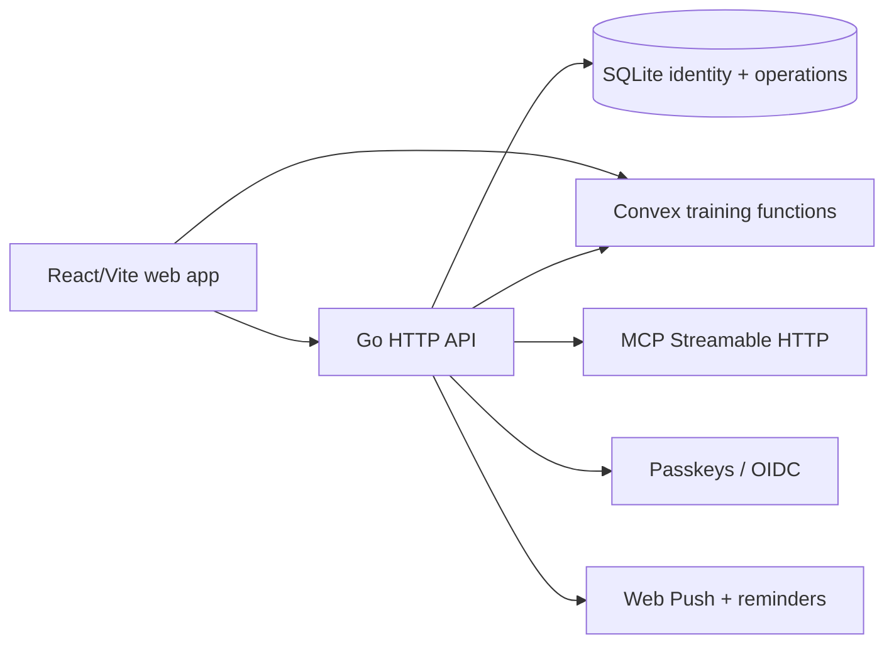

# Set & Signal

Set & Signal is a self-hostable workout planner and training log for planning
sessions, recording sets, reviewing history, and asking an AI assistant about
training data. The product ships as a React/Vite web app embedded in a Go
server, with passkeys/OIDC sign-in, Convex-backed training records, SQLite for
identity and operational state, and an MCP endpoint for assistant clients.

The project is designed for a single deployment you control. It includes an
exercise catalogue, progression and prescription helpers, workout history,
bodyweight tracking, reminders, push notifications, localization, and a
read/write MCP surface protected by the same account boundary as the web app.

## Run locally

Requires Go 1.27+, Node.js 24+, pnpm 12+, PostgreSQL-compatible Convex
deployment, and an OAuth or passkey configuration. The API refuses to start
without `CONVEX_URL`; the full training setup and migration rules are in
[docs/convex.md](docs/convex.md).

```bash
pnpm install --frozen-lockfile
CONVEX_URL=https://YOUR-DEPLOYMENT.convex.cloud \
PUBLIC_URL=http://localhost:3000 \
DATA_DIR="$PWD/data" ORIGIN=http://localhost:5173 go run ./cmd/opengym-api
```

Run the web app in a second terminal:

```bash
pnpm --dir web dev
```

For a fresh development deployment, run `pnpm exec convex dev` from `web` and
follow the setup guide to configure `AUTH_ISSUER` and `AUTH_JWKS`. Keep the
generated `web/.env.local`, signing keys, and any provider credentials out of
Git.

## Verify

```bash
go test -race ./...
go vet ./...
pnpm infra:check
```

The service is licensed under the [GNU AGPL v3 or later](LICENSE). See [`SECURITY.md`](SECURITY.md) for vulnerability reports.

## Architecture



The Go composition root is `cmd/opengym-api`. HTTP and MCP protocol concerns
live in `internal/httpapi`; training state, analytics, scheduling, and
progression live in `internal/training`; SQLite access and migrations live in
`internal/store`. The frontend follows the `app → features → domain → shared`
direction described in [docs/architecture.md](docs/architecture.md). Edit
exercise content in `web/catalog`; generated instruction files are rebuilt by
the web scripts.

## Configuration essentials

`.env.example` documents the complete runtime surface. The settings most
people need are:

| Variable | Why it matters |
| --- | --- |
| `CONVEX_URL` | Required hosted training deployment. |
| `DATA_DIR` / `DB_PATH` | Persistent SQLite, session, push, and signing-key storage. |
| `PUBLIC_URL` / `ORIGIN` | Browser origin and OAuth/MCP issuer; use a reachable HTTPS URL in production. |
| `RP_ID` / `RP_NAME` | WebAuthn relying-party identity. |
| `GOOGLE_*`, `GITHUB_*`, `APPLE_*` | Optional OIDC providers for sign-in and MCP OAuth. |
| `OPENROUTER_API_KEY` / `OPENROUTER_MODEL` | Optional AI workout planning. |

## Further documentation

- [Architecture](docs/architecture.md) — dependency direction and build layout.
- [Convex setup and migration](docs/convex.md) — hosted training ownership,
  offline queues, keys, and rollback precautions.
- [Data model](docs/data-model.md) — storage ownership and compatibility notes.
- [Product](docs/product.md) and [design](docs/design.md) — user flows and UI
  constraints.
- [Railway deployment](.railway/README.md) — infrastructure configuration.

## Status and privacy

The repository is an active, self-hosted application with a production-shaped
Convex migration path. Training records are account-scoped, but a deployment's
operator controls the API, Convex project, and persistent volume. Review
`SECURITY.md` and configure access controls before exposing an instance to
other users.
