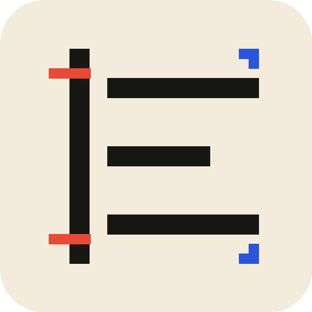
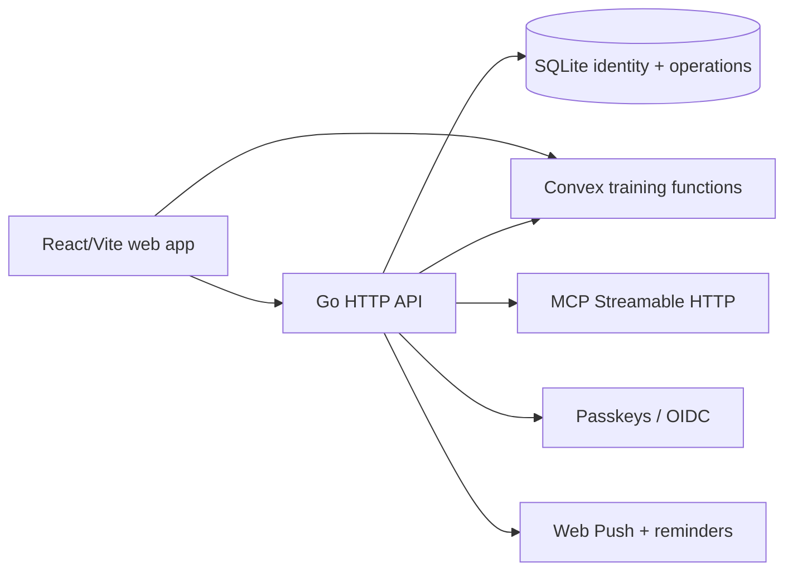

<p align="center">
  
</p>

# Set & Signal 🏋️ · Make the next set obvious

[](https://github.com/aranlucas/set-and-signal/actions/workflows/typecheck.yml)
[](https://github.com/aranlucas/set-and-signal/actions/workflows/go.yml)
[](LICENSE)

Set & Signal is a self-hostable workout planner and training log for planning
sessions, recording sets, reviewing history, and asking an AI assistant about
training data. The product ships as a React/Vite web app embedded in a Go
server, with passkeys/OIDC sign-in, Convex-backed training records, SQLite for
identity and operational state, and an MCP endpoint for assistant clients.

> **A session in the real world:** plan a push day, log the working sets as you
> go, then ask the assistant what to train next. Your history, prescription,
> and account boundary stay in the same self-hosted system.

The project is designed for a single deployment you control. It includes an
exercise catalogue, progression and prescription helpers, workout history,
bodyweight tracking, reminders, push notifications, localization, and a
read/write MCP surface protected by the same account boundary as the web app.

## Run locally

Requires Go 1.27+, Node.js 24+, pnpm 12+, a Convex deployment, and an OAuth or
passkey configuration. The API refuses to start without `CONVEX_URL`; the full
training setup and storage rules are in [docs/convex.md](docs/convex.md).

Install [Portless](https://github.com/vercel-labs/portless/tree/v0.15.7) globally.
Start its shared proxy before deriving the URLs, then launch the API in the first
terminal:

```bash
npm install -g portless@0.15.7
pnpm install --frozen-lockfile
portless proxy start
export ORIGIN="$(portless get set-and-signal)"
export PUBLIC_URL="$ORIGIN"
export RP_ID="$(node -e 'console.log(new URL(process.env.ORIGIN).hostname)')"
CONVEX_URL=https://YOUR-DEPLOYMENT.convex.cloud \
DATA_DIR="$PWD/data" pnpm dev:api
```

Launch the web app from the repository root in a second terminal:

```bash
API_TARGET="$(portless get api.set-and-signal)" pnpm dev
```

Open `https://set-and-signal.localhost` (or the printed URL). The API runs at
`https://api.set-and-signal.localhost` on its own assigned port. The frontend
generates exercise instructions before starting Vite; Portless wraps Vite
directly so its dynamic port and HMR flags reach the server.

Vite proxies `/api`, `/oauth`, `/.well-known`, and `/mcp` to `API_TARGET` with
`changeOrigin: true`. `PUBLIC_URL` matches the **frontend** origin so OAuth
discovery, callbacks, and session cookies stay on the same browser host. Use the
frontend `/mcp` URL for local MCP clients.

For a fresh development deployment, run `pnpm exec convex dev` from `web` and
configure `AUTH_ISSUER` to match `PUBLIC_URL`, along with `AUTH_JWKS`, as described
in [docs/convex.md](docs/convex.md). Keep generated `web/.env.local`, signing keys,
and provider credentials out of Git.

### Worktrees and authentication

`portless get` includes active proxy settings and the Git worktree prefix; run
both terminals from the same checkout. Use a separate `DATA_DIR` for isolated
worktree data. Passkeys registered for `localhost` are not credentials for the
new relying-party hostname; register a development passkey for the named origin.
Authorize the exact frontend `/oauth/callback/<provider>` URL with each OIDC
provider. Google rejects `.localhost` callback domains; use a local subdomain of
a domain you own with Portless's `--tld` option.

Portless starts a shared HTTPS proxy and may request local administrator access on
first use to bind port 443 and trust its development certificate. Use the URL it
prints if your proxy uses a custom port or domain. Stop the command with Ctrl+C;
`portless doctor` checks local proxy, certificate, and DNS setup.

## Verify

```bash
go test -race ./...
go vet ./...
(cd .railway && go test ./... && go vet ./...)
```

The service is licensed under the [GNU AGPL v3 or later](LICENSE). See [`SECURITY.md`](SECURITY.md) for vulnerability reports.

## Architecture



The Go composition root is `cmd/opengym-api`. HTTP and MCP protocol concerns
live in `internal/httpapi`; training state, analytics, scheduling, and
progression live in `internal/training`; SQLite access and migrations live in
`internal/store`. The frontend follows the `app → features → domain → shared`
direction described in [docs/architecture.md](docs/architecture.md). Edit
exercise content in `web/catalog`; generated instruction files are rebuilt by
the web scripts.

## Configuration essentials

`.env.example` documents the complete runtime surface. The settings most
people need are:

| Variable | Why it matters |
| --- | --- |
| `CONVEX_URL` | Required hosted training deployment. |
| `DATA_DIR` / `DB_PATH` | Persistent SQLite, session, push, and signing-key storage. |
| `PUBLIC_URL` / `ORIGIN` | Browser origin and OAuth/MCP issuer; use a reachable HTTPS URL in production. |
| `RP_ID` / `RP_NAME` | WebAuthn relying-party identity. |
| `GOOGLE_*`, `GITHUB_*`, `APPLE_*` | Optional OIDC providers for sign-in and MCP OAuth. |
| `OPENROUTER_API_KEY` / `OPENROUTER_MODEL` | Optional AI workout planning. |

## Further documentation

- [Architecture](docs/architecture.md) — dependency direction and build layout.
- [Convex setup and storage](docs/convex.md) — hosted training ownership,
  offline queues, keys, and current format requirements.
- [Data model](docs/data-model.md) — storage ownership and current contracts.
- [Product](docs/product.md) and [design](docs/design.md) — user flows and UI
  constraints.
- [Railway deployment](.railway/README.md) — infrastructure configuration.

## Status and privacy

The repository is an active, self-hosted application with hosted
Convex training storage. Training records are account-scoped, but a deployment's
operator controls the API, Convex project, and persistent volume. Review
`SECURITY.md` and configure access controls before exposing an instance to
other users.
